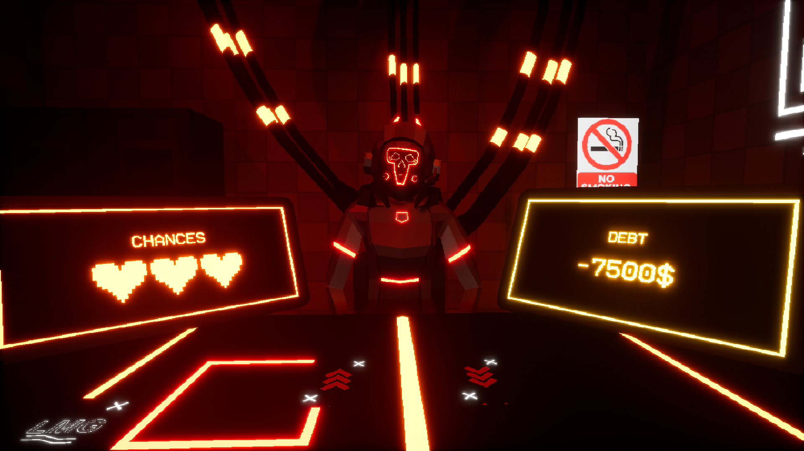
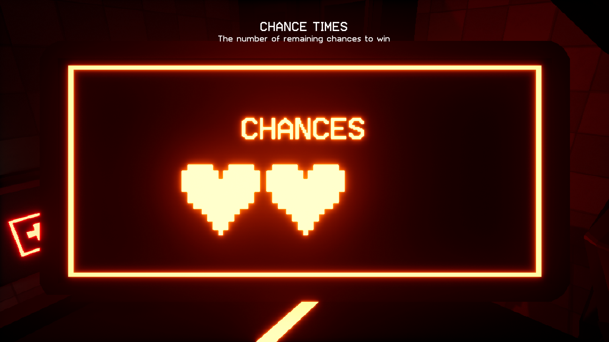
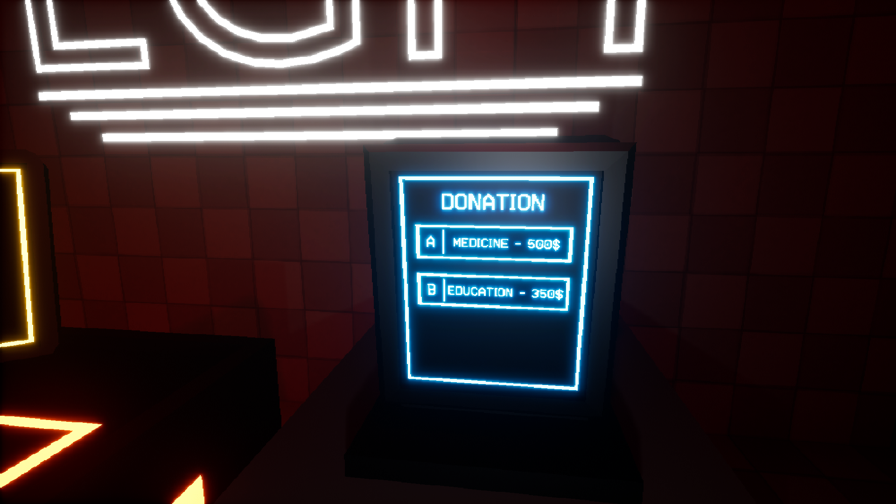

# Karma-Gaming
Horror Card Game inspired by Buckshot Roulette and Squid Game. Made with Unreal Engine and Blueprints.
Link to the game: https://hazmatik.itch.io/karmagaming

## Gameplay

This is a card game. Where you need to pick up a card from a stack of cards on the table. Then choose from any of 2 options - if the face value of your cards are less or more than the cards on the table.

You can donate to charity using a special donation machine and receive special reward cards.

Insurance - will add 1 point to your health reserve
School cheat sheet - allows you to check the value of the cards.
